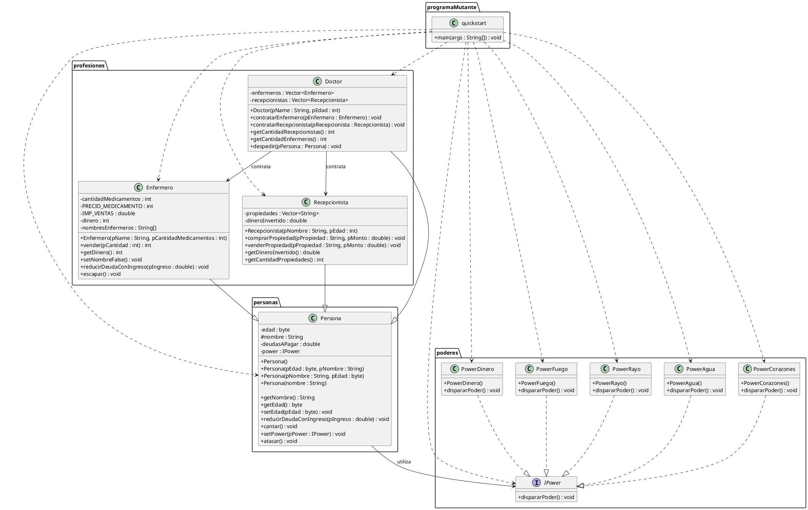

# Programa Mutante

## Descripción

Este proyecto es un programa desarrollado en Java para demostrar conceptos fundamentales de Programación Orientada a Objetos (POO), principalmente herencia, polimorfismo, encapsulamiento y organización mediante paquetes.

El programa utiliza una clase general `Persona`, de la cual heredan tres profesiones diferentes: `Enfermero`, `Doctor` y `Recepcionista`.

Además, se implementa una interfaz llamada `IPower`, que permite crear cinco poderes mutantes diferentes. Cada poder tiene su propia implementación del método `dispararPoder()`, mostrando una representación diferente en la consola.

El programa principal crea personas con diferentes profesiones y asigna poderes mutantes, demostrando que el comportamiento de la profesión y el poder son independientes.

---

## Estructura del proyecto

El proyecto está organizado en cuatro paquetes:

```text
src/
├── personas/
│   └── Persona.java
│
├── profesiones/
│   ├── Enfermero.java
│   ├── Doctor.java
│   └── Recepcionista.java
│
├── poderes/
│   ├── IPower.java
│   ├── PowerCorazones.java
│   ├── PowerDinero.java
│   ├── PowerFuego.java
│   ├── PowerRayo.java
│   └── PowerAgua.java
│
└── programaMutante/
    └── quickstart.java
```

---

## Clases principales

### Persona

`Persona` es la clase base del programa.

Contiene atributos como la edad, el nombre, las deudas y el poder asignado. También proporciona métodos para obtener y modificar información de la persona, cantar, reducir deudas y utilizar su poder.

Entre sus principales métodos se encuentran:

- `getNombre()`
- `getEdad()`
- `setEdad()`
- `reducirDeudaConIngreso()`
- `cantar()`
- `setPower()`
- `atacar()`

El atributo `nombre` tiene visibilidad `protected`, permitiendo que las clases hijas puedan utilizarlo directamente. Otros atributos, como `edad`, `deudasAPagar` y `power`, son `private` para mantener el encapsulamiento.

---

## Profesiones

Las tres profesiones heredan de `Persona`.

### Enfermero

La clase `Enfermero` representa una profesión que administra y vende medicamentos.

Entre sus métodos se encuentran:

- `vender()`
- `getDinero()`
- `setNombreFalse()`
- `reducirDeudaConIngreso()`
- `escapar()`

También sobrescribe el método `reducirDeudaConIngreso()` de `Persona`.

### Doctor

La clase `Doctor` hereda de `Persona` y mantiene colecciones de enfermeros y recepcionistas.

Permite:

- Contratar enfermeros.
- Contratar recepcionistas.
- Consultar la cantidad de enfermeros.
- Consultar la cantidad de recepcionistas.
- Despedir personas.

Utiliza `Vector` para almacenar los enfermeros y recepcionistas asociados.

### Recepcionista

La clase `Recepcionista` hereda de `Persona` y administra propiedades y dinero invertido.

Sus principales métodos son:

- `comprarPropiedad()`
- `venderPropiedad()`
- `getDineroInvertido()`
- `getCantidadPropiedades()`

---

## Poderes mutantes

El programa utiliza la interfaz `IPower`.

Esta interfaz define el método:

```java
public void dispararPoder();
```

Las cinco clases de poderes implementan esta interfaz:

1. `PowerCorazones`
2. `PowerDinero`
3. `PowerFuego`
4. `PowerRayo`
5. `PowerAgua`

Cada clase proporciona una implementación diferente de `dispararPoder()`, por lo que cada poder muestra una representación distinta en la consola.

### Representación de los poderes

| Poder | Representación |
|---|---|
| PowerCorazones | ♥♥♥♥♥♥ |
| PowerDinero | $$$$$$$$$$$$$ |
| PowerFuego | ☼☼☼☼☼☼☼☼ |
| PowerRayo | ↓↓↓↓↓↓↓↓↓↓ |
| PowerAgua | ~~~~~~~ |

---

## Herencia

La herencia se utiliza para crear diferentes profesiones a partir de la clase `Persona`.

```text
Persona
├── Enfermero
├── Doctor
└── Recepcionista
```

Las tres clases reutilizan los atributos y métodos de `Persona` y además incorporan comportamientos propios de cada profesión.

Por ejemplo, `Enfermero` tiene el método `vender()`, `Doctor` puede contratar profesionales y `Recepcionista` puede comprar y vender propiedades.

---

## Polimorfismo

El polimorfismo se utiliza principalmente mediante la interfaz `IPower`.

En `Persona`, el atributo:

```java
private IPower power;
```

permite que una persona tenga cualquier objeto que implemente `IPower`.

El método:

```java
public void atacar(){
    this.power.dispararPoder();
}
```

invoca `dispararPoder()` sin que `Persona` necesite conocer cuál de los cinco poderes concretos está utilizando.

Por ejemplo:

```java
Persona p = new Enfermero(...);

p.setPower(new PowerFuego());

p.atacar();
```

En este caso, aunque `power` está declarado como `IPower`, Java ejecuta la implementación correspondiente a `PowerFuego`.

Esto demuestra que el comportamiento del poder se determina en tiempo de ejecución.

---

## Independencia entre profesión y poder

El programa demuestra que la profesión y el poder son comportamientos independientes.

Una persona puede ser un `Enfermero`, `Doctor` o `Recepcionista` y utilizar cualquiera de los cinco poderes.

Por ejemplo:

```text
Enfermero + PowerFuego
Doctor + PowerAgua
Recepcionista + PowerRayo
```

La profesión determina las acciones profesionales que puede realizar la persona, mientras que el poder determina el comportamiento de `atacar()`.

---

## Programa principal

La clase `quickstart` contiene el método `main()` y se encuentra en el paquete:

```java
programaMutante
```

En el programa principal se crean cinco personas mediante un arreglo de tipo `Persona`:

```java
Persona profesionales[] = new Persona[5];
```

Se utilizan las tres profesiones:

- `Enfermero`
- `Doctor`
- `Recepcionista`

También se crean los cinco poderes:

```java
IPower poderesDisponibles[] = {
    new PowerCorazones(),
    new PowerDinero(),
    new PowerFuego(),
    new PowerRayo(),
    new PowerAgua()
};
```

Cada una de las cinco personas recibe un poder diferente:

```java
profesionales[i].setPower(poderesDisponibles[i]);
```

Finalmente, se recorre el arreglo y cada persona utiliza su poder mediante:

```java
for (Persona p : profesionales) {
    System.out.println("Ataca " + p.getNombre());
    p.atacar();
}
```

---

## Cómo ejecutar el programa

Desde la carpeta `src`, primero se deben compilar las clases:

```powershell
javac -d ..\bin personas\*.java poderes\*.java profesiones\*.java programaMutante\*.java
```

Después se ejecuta la clase principal:

```powershell
java -cp ..\bin programaMutante.quickstart
```

---

## Diagrama de clases

El siguiente código corresponde al diagrama de clases realizado en PlantUML:



---

